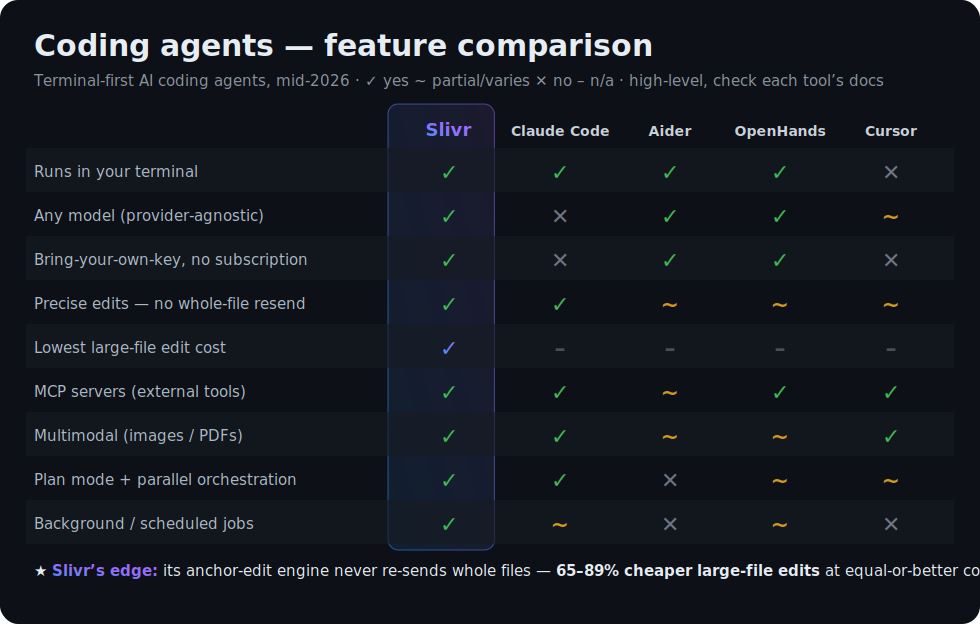

<p align="center"></p>

<h1 align="center">Slivr</h1>

<p align="center"><b>The coding agent that edits a <i>sliver</i>, not the whole file.</b></p>

A fast, low-cost CLI coding agent for your terminal — driven by **any** model you plug in (Claude,
GPT, Gemini, …) over OpenRouter. Slivr's edge is its **edit engine**: a precise anchor-based protocol
that changes code **without ever re-sending whole files**, so edits stay cheap and never land in the
wrong place.

- 🎯 **Precise edits** — sends a tiny unique snippet, never the whole file; refuses ambiguous anchors instead of silently editing the wrong line.
- ⚡ **Cheap on big files** — large-file edits are **65–89% cheaper at equal-or-better correctness** (measured, 130-run benchmark), where full-rewrite tools blow up. (Small files: a wash — [honest breakdown](INVENTION.md).)
- 🔌 **Any model** — fully provider-agnostic via OpenRouter; swap models mid-session.
- 🧰 **Full toolbox** — read / edit / multi-edit / run / grep / glob / git.
- 🔗 **MCP** — connect external tool servers (Model Context Protocol).
- 👁 **Multimodal** — `view_image` / `view_pdf` so the model can see screenshots & read PDFs.
- 🗂 **Orchestration** — parallel sub-agents, plan-mode, live task checklists.
- ⏱ **Background & scheduled** — detached jobs + a schedule poller.
- 🛡 **Safe** — diff-preview approval, destructive-command blocklist, workdir sandbox.
- ⌨️ **REPL** — streaming colored diffs, Shift-Tab to cycle modes, persistent context.

> **How the edit engine works**, why it's cheaper, the measured results, and the honest scope:
> **[INVENTION.md](INVENTION.md)**.

## Install

```bash
# one line — puts `slivr` on your PATH (pure Node >= 18, no build, no deps)
curl -fsSL https://raw.githubusercontent.com/dhyabi2/slivr/main/install.sh | bash

# …or run without installing
npx github:dhyabi2/slivr --help

# …or from a clone
git clone https://github.com/dhyabi2/slivr && cd slivr && npm link
```

> **Pin a version.** The one-liner tracks `main` by default. To install a specific tag/commit, set
> `REF`: `REF=v1.2.3 curl -fsSL https://raw.githubusercontent.com/dhyabi2/slivr/main/install.sh | bash`.
> Prefer to read before you run? Download `install.sh` and inspect it first, then run it locally.
> If `/usr/local/bin` isn't writable the installer falls back to `~/.local/bin` and appends that
> directory to your shell rc (`.zshrc`/`.bashrc`/`.profile`); it prints the exact install path.

**Upgrading.** If you installed via the one-liner (or a clone), update in place:

```bash
slivr upgrade            # fast-forward the install to the latest release
slivr upgrade --check    # just tell me if a newer version exists (no changes)
```

It only moves forward, refuses to clobber a dirty or locally-ahead checkout, and verifies the new
version runs before declaring success. Installed via `npx`? It always pulls the latest, so there's
nothing to upgrade.

## How Slivr compares

A high-level snapshot of terminal-first coding agents (mid-2026 — check each tool's docs for the
latest; `~` = partial / varies).

<p align="center">
  
</p>

Slivr's distinctive combination: **provider-agnostic + bring-your-own-key + the lowest measured
large-file edit cost** (its anchor-edit engine), with the full modern toolbox (MCP, multimodal,
plan-mode, orchestration, background jobs) in a single terminal binary. It does **not** claim to be
*smarter* than any of these — quality comes from the model you plug in; Slivr competes on edit cost,
reliability, and openness. ([the honest, measured scope](INVENTION.md).)

## Quickstart (daily use)

```bash
# 1. install (see Install above) — one line:
curl -fsSL https://raw.githubusercontent.com/dhyabi2/slivr/main/install.sh | bash

# 2. set your key (preferred: env var)
export OPENROUTER_API_KEY=sk-or-...

# 3. (optional) configure the model + defaults for this repo
slivr --init                    # writes a starter ./.slivr.json
slivr config                    # show the resolved config and where each value came from

# 4. work
slivr                                                  # interactive REPL in the current repo
slivr "add input validation to src/calc.js"            # one-shot in the current dir
slivr "fix the failing test" ./myrepo --auto           # one-shot, no approval prompts
slivr --model anthropic/claude-sonnet-4                # REPL on Claude
```

### The REPL
Running `slivr` with no task opens a multi-turn session. **Conversation + tool results persist
across turns** — ask a follow-up and the agent still has the context. As it works it streams each
step (`✓ edit src/foo.js +3 -1`) with a compact colored unified diff of every change. **Ctrl-C**
interrupts the current turn without killing the session; a second Ctrl-C at the prompt exits.

REPL commands: `/help` · `/model <id>` (switch model mid-session) · `/cost` (session tokens + $) ·
`/reset` (clear context, keep cost totals) · `/exit`.

### Config (`slivr config`, `--init`)
Resolved with precedence **flags > `./.slivr.json` > `~/.slivr.json` > env > defaults**. Keys:
`model`, `apiKey` (prefer the `OPENROUTER_API_KEY` env var), `baseUrl` (default OpenRouter),
`approval` (`auto`|`edits`|`all`), `maxSteps`, `maxTokensPerTurn`, and `mcpServers` (see
[MCP](#mcp--connect-external-tool-servers)). **The model is fully configurable** — any OpenRouter id
works: `anthropic/claude-sonnet-4`, `openai/gpt-4o`, `google/gemini-2.5-flash`, etc.

**Environment variables.** Every scalar config key can be set from the environment (env sits below
config files and flags in precedence):

| Env var | Config key | Notes |
|---|---|---|
| `OPENROUTER_API_KEY` | `apiKey` | preferred way to supply your key |
| `SLIVR_API_KEY` | `apiKey` | alternative key var; **overrides** `OPENROUTER_API_KEY` if both set |
| `MODEL` | `model` | back-compat with the original benchmark CLI |
| `SLIVR_MODEL` | `model` | **overrides** `MODEL` if both set |
| `SLIVR_BASE_URL` | `baseUrl` | default `https://openrouter.ai/api/v1` |
| `SLIVR_APPROVAL` | `approval` | one of `auto` \| `edits` \| `all` |
| `SLIVR_MAX_STEPS` | `maxSteps` | integer (default 16) |
| `SLIVR_MAX_TOKENS` | `maxTokensPerTurn` | integer (default 4000) |

### Code navigation (`find_symbol` / `repo_map`)
slivr builds a zero-dependency **symbol index** of the repo (regex scan; no vector DB) so the agent
can **jump to a definition** instead of grepping through every mention: `find_symbol <name>` →
`file:line` + signature; `repo_map` → a compact map of files and their top-level symbols. On slivr's
own source this resolves 100% of lookups to the exact single definition vs grep's 2–8 lines of noise.
See [docs/INVENTION-block3-repo-symbol-index.md](docs/INVENTION-block3-repo-symbol-index.md).

### Verify-and-repair (`--verify`)
Give slivr a check and it won't finish until the check passes. When the agent calls `done`, slivr runs
your verification command; if it fails, the output is fed back and the agent must fix it and finish
again (up to `--repair N`, default 3). It never finishes "green" on a failing check.

```bash
slivr "make the failing tests pass" --auto --verify "npm test"
slivr "fix the type errors" --auto --verify "tsc --noEmit" --repair 5
```

On a measured A/B over real [LiveCodeBench](bench/LIVECODEBENCH.md) problems this roughly **doubled
pass@1** (3/7 → 6/7 with `google/gemini-2.5-flash`) — the agent runs its own code, reads the failure,
and repairs it. See [docs/INVENTION-block1-verify-repair.md](docs/INVENTION-block1-verify-repair.md).

### Safety / approval modes
There are **two real behaviors**:
- `auto` — never prompts (trusted flows / CI). **Destructive commands are still hard-blocked.**
- `edits` (default) — asks `y/N` before every `run_command` and every file edit/create, showing a
  diff preview for edits.
- `all` — **an alias of `edits`**: it prompts for exactly the same mutating/effecting actions (file
  edits/creates and `run_command`). It is *not* a stricter mode; it's kept for clarity/back-compat.

Regardless of mode, an always-on blocklist **hard-refuses** obviously destructive commands
(`rm -rf /`, fork bombs, `curl … | sh` from the network, `git push --force`, `dd`/`mkfs` to a
disk, `sudo`, machine shutdown, …). `run_command` is also sandboxed to the working directory.

### CLI reference
```
slivr                       interactive REPL in the current directory
slivr "<task>" [dir]        one-shot
slivr config                print resolved config
slivr --init                write a starter ./.slivr.json
slivr mcp list              connect configured MCP servers and list their tools
slivr mcp add <name> -- <command...>   add an MCP server to ./.slivr.json
slivr skills                list skills    ·   slivr skill <name> [args]   run one
slivr bg "<task>" [dir]     detached background run (POSIX)  ·  jobs / logs <id>
slivr schedule "<task>" --in 30m|--at <ISO>|--cron "<expr>"   ·  schedule list / clear
slivr scheduler [--daemon|status|stop] [--every <sec>]   run/manage the schedule poller
slivr upgrade [--check]     update the install to the latest version (forward-only, dirty-safe)
flags: --model <id>  --approval <auto|edits|all>  --auto  --plan  --dir <path>  --max-steps <n>
       --baseline (one-shot full-rewrite harness, for the benchmark)  --help  --version
```

**Robustness:** malformed model output, network/provider failures, missing/binary/oversized files,
dead or slow MCP servers, and malformed config/skill/job files all degrade gracefully — they produce
a clear error or are skipped with a warning, never an uncaught crash; oversized tool results are
clipped so context doesn't blow up. `web_search` (OpenRouter web plugin) makes its own model call and
returns its token usage so that cost isn't hidden from the session total.

(`node bin/agent.mjs "<task>" <dir> [--baseline]` is still supported for the original benchmark.)

### Orchestration, plan-mode & tasks

The agent has four extra capabilities for non-trivial, multi-step work:

**`parallel` — fan-out orchestration.** The model can call `parallel` to run several **independent**
subtasks as their *own* sub-agents *concurrently* (up to **4** at a time, **one level deep** — a
sub-agent cannot fan out further). The main agent decomposes → fans out with `parallel` → integrates.
```jsonc
{"tool":"parallel","args":{"tasks":["research how X works","find every call site of Y"]}}
// returns: [{task, summary, done, turns}, …]
```
⚠️ **Shared-workdir caveat:** all sub-agents share the *same* working directory, so `parallel` is
only safe for **independent** work — research/exploration in parallel, or edits to **disjoint** files.
Never parallelize subtasks that touch the same file or depend on each other's output (you'll get
races / lost writes). For sequential or overlapping work the agent edits one tool-call at a time.

**`--plan` / `/plan` — plan-mode.** When on, the agent must first call `plan` with a numbered list of
concrete steps; **all edits and commands are blocked until a plan exists and is approved.** The harness
prints the plan and asks `proceed? [y]es / [e]dit / [n]o` — `edit` lets you type a revised plan, `no`
aborts. Under `--auto` the plan is **auto-approved** but still shown.
```
slivr --plan "refactor the auth module"        # interactive: review the plan, then it executes
slivr --plan --auto "add a healthcheck route"  # shows the plan, auto-approves, executes
# REPL: /plan [on|off]   toggle for the session (re-planned each request)
```

**`task_write` — live task checklist.** The agent maintains a to-do list it updates as it works; the
UI renders it live (`☐` pending · `◐` in_progress · `✓` completed), keeping exactly one task
`in_progress`, and prints a final summary at the end.
```jsonc
{"tool":"task_write","args":{"tasks":[
  {"id":"1","subject":"explore the codebase","status":"completed"},
  {"id":"2","subject":"apply the fix","status":"in_progress"},
  {"subject":"run the tests","status":"pending"}
]}}
```

**`--auto` — no prompts.** Skips *all* approval prompts (edits, commands, **and** plan approval) while
the destructive-command **blocklist still fires** (`rm -rf /`, `sudo`, `curl … | sh`, etc. are refused
even in `--auto`).

### MCP — connect external tool servers

slivr is an **MCP (Model Context Protocol) client** (stdio transport), the same extensibility
Claude Code has. Point it at any MCP server and that server's tools become callable by the model as
**namespaced tools** `mcp__<server>__<tool>` — they're appended to the system prompt (name + one-line
description + a compact input-schema hint) and dispatched over JSON-RPC 2.0 to the server process.

Configure servers in `./.slivr.json` (or `~/.slivr.json`) under an `mcpServers` block — the same
shape Claude Desktop uses:
```jsonc
{
  "model": "anthropic/claude-sonnet-4",
  "mcpServers": {
    "everything": {                                  // reference test server (echo/add/…)
      "command": "npx",
      "args": ["-y", "@modelcontextprotocol/server-everything"],
      "env": {},                                     // optional extra env for the child
      "disabled": false                              // set true to keep the entry but skip it
    },
    "fs": {                                           // filesystem server scoped to a dir
      "command": "npx",
      "args": ["-y", "@modelcontextprotocol/server-filesystem", "/path/to/project"]
    }
  }
}
```
Then:
```
slivr mcp list                                       # connect + print discovered tools per server
slivr mcp add weather -- npx -y some-weather-mcp     # write a server entry into ./.slivr.json
slivr "use mcp__everything__echo to echo 'hi'"       # the model calls the namespaced tool
```
When the REPL/one-shot starts it connects every enabled server, surfaces their tools, and **kills the
child processes cleanly on exit**. A broken or missing server is reported and skipped — it never blocks
the rest. If no `mcpServers` are configured, nothing changes and slivr behaves exactly as before.

### Multimodal — let the model SEE images and READ PDFs

slivr can attach images and PDFs to the conversation so a vision model actually looks at them. Two
tools (both sandboxed to the workdir):

- `view_image({path})` — png/jpg/jpeg/gif/webp/bmp. The loop pushes a user message whose `content`
  is a block array `[{type:'text'},{type:'image_url',image_url:{url:'data:image/<ext>;base64,…'}}]`.
- `view_pdf({path})` — the loop pushes `[{type:'text'},{type:'file',file:{filename,file_data:'data:application/pdf;base64,…'}}]`
  and the provider auto-attaches OpenRouter's `file-parser` plugin (`{id:'file-parser',pdf:{engine:'pdf-text'}}`)
  whenever a PDF is in context, so the PDF text is extracted for the model.

Use a **multimodal model** (e.g. `google/gemini-2.5-flash`). Just ask in plain language:
```
slivr "view_image screenshot.png and describe the error dialog" --auto
slivr "view_pdf spec.pdf and summarize section 3" --auto
```
Verified live: the agent read the word and colors in a generated PNG, and extracted text from a PDF.

**PDF text extraction (with automatic local fallback).** For text PDFs slivr first tries OpenRouter's
`file-parser` plugin (`pdf-text`). If that's unavailable or the model can't ingest the file block,
`view_pdf` **automatically falls back to a local extractor** — `pdftotext` (poppler) or `mutool` if
either is on your `PATH` — and returns the extracted text. If a PDF has **no extractable text** (a
scanned/image PDF), it says so plainly (`no extractable text — likely a scanned PDF; OCR not
supported`) instead of failing silently or hallucinating. So: text PDFs just work (plugin *or* local
tool); scanned PDFs are clearly reported as needing OCR (out of scope).

### Skills — reusable prompt templates (`/skills`, slash-commands)

A skill is a Markdown file = a saved prompt you can run by name. Discovery order: **`./.slivr/skills/*.md`
(project)** then **`~/.slivr/skills/*.md` (user)**; a project skill shadows a user skill of the same
name. Each file: an optional `# Title`, an optional `<!-- description: … -->` (or `---`/frontmatter),
and a body where `$ARGS` / `{{args}}` is replaced by the user's args and `$1 $2 …` by positional words.

```
slivr skills                       # list discovered skills (name + description)
slivr skill review                 # run a skill one-shot
slivr skill commit "context here"  # args fill $ARGS / $1 …
```
In the REPL:
```
/skills              list skills
/run review          run a skill as a turn
/review              same — /<name> runs a skill if it isn't a built-in command
```
Ships with three examples under [`.slivr/skills/`](.slivr/skills/): `review.md` (review the staged
diff), `test.md` (find + run the suite, fix failures), `commit.md` (write a message + commit). Drop
your own `.md` files in `./.slivr/skills/` to add more — no code changes.

Example skill (`.slivr/skills/review.md`):
```markdown
# Review staged diff
<!-- description: review the staged git diff for bugs and issues -->
Review the staged git changes for bugs and edge cases. Extra focus: $ARGS
Report concrete findings; do NOT edit anything.
```

### Background & scheduled tasks

Run a task in a **detached** process (it keeps running after the command returns), or schedule one
for later. State lives under `~/.slivr/` (`jobs/<id>.json` + `jobs/<id>.log`, and `schedule.json`).

```
slivr bg "fix the failing test and commit" ./repo   # detached; runs slivr one-shot --auto
slivr jobs                                           # list jobs: id, status (queued/running/done/failed), task
slivr jobs --watch                                   # repaint every 2s
slivr logs <id>                                      # print that job's captured log

slivr schedule "run the nightly check" --in 2h       # also: --at <ISO>  or  --cron "*/5 * * * *"
slivr schedule list                                  # scheduled jobs, GROUPED active vs done, + next run
slivr schedule clear                                 # prune completed once-jobs from the schedule

# the poller (runs due jobs) — foreground OR as a detached background service:
slivr scheduler                                      # foreground sleep-loop poller (Ctrl-C to stop)
slivr scheduler --daemon                             # detach + write ~/.slivr/scheduler.pid
slivr scheduler status                               # report running / not (reads the pidfile)
slivr scheduler stop                                 # stop the detached poller
```
**Honest about the design:** `slivr bg` spawns a real detached child (`spawn(..., {detached:true,
stdio:'ignore'})`) on **macOS/Linux**; on Windows (or if the detached spawn fails) it refuses with a
clear message rather than crashing — background tasks need a POSIX shell. `slivr scheduler` is a
**simple sleep-loop poller** (default every 30s; `--every <sec>`), **not a system cron daemon** —
scheduled jobs only fire while it's running. Run it in the foreground, or `--daemon` it (it survives
the terminal and is managed via `scheduler status` / `scheduler stop`), or wrap it in launchd/systemd
for boot persistence. When the poller hits a due job it spawns it in the background exactly like
`slivr bg`; once-jobs are marked `done` (clear them with `schedule clear`), cron-jobs are rescheduled
to their next time. The built-in cron parser supports the common 5-field forms (`*`, `*/n`, `a,b`, `a-b`).

---

## Why it exists (the harness-level claim)

It exists to test ONE claim at the **harness level** (not model-vs-model, not model-building):

> Swap *only* the edit/context protocol — keep the same model, tools, and loop — and a
> **compact anchor-based edit protocol** matches task success at **lower session cost** than the
> naive **full-file rewrite** protocol that Claude-Code-style harnesses use. The win grows with
> file size and multi-edit sessions.

## The two harnesses (only one thing differs)
| | slivr | baseline (Claude-Code-style) |
|---|---|---|
| model | configurable (same) | configurable (same) |
| tools | read_file, list_dir, grep, run_command (same) | same |
| loop | one JSON tool-call/turn (same) | same |
| **edit protocol** | **compact**: `{anchor, replacement, op}` via SEAL; failure → small repair packet | **naive**: re-read whole file → `write_file` ENTIRE new content |

The compact applier (`src/seal.mjs`) is **vendored read-only** from
`better-cc-fresh/src/seal.mjs` (attributed in-file). It only applies on a UNIQUE exact/normalized
match, rejects ambiguous anchors, and on a miss returns a compact **repair packet** (nearest real
spans + a fix instruction) — it never re-sends the file. That compact-edit protocol is the entire
harness-level advantage under test.

## Measured head-to-head (REAL numbers, ground-truth oracles)

Each task is seeded into a fresh repo; both harnesses run on the SAME model; a behavioral oracle
executes the resulting code and asserts observable behavior (exit 0 == success). Raw rows in
`bench/results.json`.

### `google/gemini-2.5-flash` — full suite (8 tasks)

| harness | success | total tokens | total cost | total turns | edit failures |
|---|---|---|---|---|---|
| **slivr** | **7/8** | **27,406** | **$0.01126** | 35 | 0 |
| baseline | 7/8 | 580,322 | $0.31099 | 82 | 0 |

**Equal success (7/8 each) at 96.4% lower total cost** on the same model. Cost saved by file-size
regime: large-single **99.3%**, small-single **66.4%**, small-multi **56.5%**, medium-single 5.1%.

Each harness failed exactly one task, for opposite reasons that illustrate the thesis:
- **baseline** failed `fix-bug-largefile`: full-rewriting the 246-line file every turn ran away to
  521k tokens, hit the step cap, and never converged — the runaway-context failure mode.
- **slivr** failed `config-constant`: the model emitted **syntactically invalid code**
  (`export import {...}`) — a *model* error, not a harness one (slivr made the edits cleanly in 3
  turns with 0 edit failures). An earlier version of slivr failed this task with 15 edit failures
  because it lacked a file-creation tool; adding `create_file` fixed that harness gap (the remaining
  failure is purely the model writing bad JS).

Per-task rows are in `bench/results.json`.

### `anthropic/claude-sonnet-4` — small-file subset (3 tasks, budget-limited)

| harness | success | total tokens | total cost | total turns |
|---|---|---|---|---|
| slivr | 3/3 | 22,834 | $0.09227 | 22 |
| baseline | 3/3 | 22,589 | $0.09304 | 24 |

Deliberately run on only the **small** tasks (no large-file blowup) to cap spend. Result: a **tie**
— both 3/3, cost within **0.8%**. This is the honest flip side: **on small files the compact-edit
advantage is negligible** regardless of model. The big cost win is a large-file / multi-edit
phenomenon, not a universal one. (Raw: `bench/results-sonnet-small.json`.)

### The headline: large file, single bug fix (`fix-bug-largefile`, 246-line module)
| harness | success | tokens | cost | turns |
|---|---|---|---|---|
| **slivr** | **PASS** | 5,912 | **$0.00201** | 3 |
| baseline | FAIL | 521,859 | $0.28859 | 16 (hit cap) |

On a large file the baseline doesn't just cost more — it **derails**: re-reading and re-writing the
whole 246-line file every turn burned **521k tokens**, hit the step cap, cost ~**$0.29**, and still
failed the oracle. slivr read once, made one targeted edit, verified, and finished: **99.3%
cheaper AND higher success**. This is the clearest expression of the thesis.

### Where the win is marginal or NEGATIVE (honest)
On a **tiny single-edit file** (`fix-offbyone`, 7 lines) slivr was **~73% MORE expensive**
(4,344 vs 2,163 tokens) — both passed. A full rewrite of a 7-line file is trivially cheap, while
the compact protocol pays overhead (verbose anchors, an extra exploration turn). **The advantage
is conditional on file size / edit locality.** It pays off on large files and multi-edit sessions
where the baseline keeps re-sending large file bodies; it is a net cost *loss* on tiny files.

## The precise sense in which it's a better Claude Code alternative
Same model, same capability — **equal-or-better task success at dramatically lower session cost on
large-file and multi-edit work**, because it never re-sends whole files to make a change and recovers
from failed edits via a compact structured packet instead of re-showing the file. On small files the
edge disappears or reverses, so the honest pitch is: *cheaper where it matters (big files, long
sessions), neutral-to-slightly-worse on trivial edits.*

## Honest limits
- **Small n** (8 tasks), and the LLM is nondeterministic — numbers are directional, not p-values.
- The cost win is **conditional**: large/locality-friendly edits win big; tiny single edits lose.
- A failing baseline run that hits the step cap inflates its token/cost numbers — that *is* a real
  harness failure mode of full rewrites (runaway context), but it makes aggregate "X% cheaper"
  sensitive to how many baseline runs blow up. Per-task rows (in `results.json`) are the honest view.
- The applier is correctness-first but JS/code-shaped; it is not a general semantic refactor engine.

## Layout
- core: `src/provider.mjs` `src/tools.mjs` `src/loop.mjs` `src/agent.mjs` (`Session`) `src/baseline.mjs` `src/seal.mjs` (vendored)
- persistence: `src/supervisor.mjs` (`runUntilDone` + `Session.runUntilDone`) — an outer loop that keeps
  continuing the SAME thread with a targeted nudge each round until every checklist task is done AND
  verified, or a budget / no-forward-progress stop; the `/finish` REPL command drives it
- daily-use layer: `src/config.mjs` (layered config) · `src/repl.mjs` (interactive session) ·
  `src/diff.mjs` (unified-diff renderer) · `src/safety.mjs` (blocklist + approval) · `src/ui.mjs` (colors/footer)
- MCP client: `src/mcp.mjs` (stdio JSON-RPC client + tool catalog) · `test/stub-mcp.mjs` (local test server)
- multimodal: `src/multimodal.mjs` (image/pdf block builders + pdf-plugin) · tools `view_image`/`view_pdf` in `src/tools.mjs`
- skills: `src/skills.mjs` (discovery + arg substitution) · `.slivr/skills/*.md` (example prompts) · user
  skills in `~/.slivr/skills/` (e.g. klokwork 3D engine, vgsds 3D-asset MCP, level/multiplayer patterns)
- 3D games: build on Klokwork (games layer over three.js); 3D ASSETS must come from the vgsds MCP (verified,
  textured GLB) — enforced by `assetSourceViolation` (src/structure.mjs) in the done-gate
- game verification: `src/structure.mjs` (production scene-graph contract) · `src/levelcert.mjs` (lock-and-key
  solvability/soft-lock certifier, vendored from esg-coreach) + the `certify_level` tool · `vendor/loft/`
  (serverless realtime-multiplayer protocol, vendored from loft-poc, for generated games)
- node servers: `src/server.mjs` (spawn an app, wait for its port, hand back an http URL, kill on teardown)
  + tools `start_server`/`stop_server`/`http_request`/`install_deps` (approval-gated, `--ignore-scripts` by
  default); the eye + `see_page` accept an `http://` URL so a running app is verified over HTTP (not just
  static `file://`), and the done-gate verifies a SERVED game over HTTP when there's no static index.html
- harness-over-HTTP: `src/proxy.mjs` (a zero-dep injecting proxy) + async URL renders (`renderDomUrl`/
  `renderDomGLUrl`) + `autoPlayUrl`/`extractLevelsUrl`/`screenshotWebGLUrl` so autoplay, level-cert and
  canvas-capture run against a SERVED game at full parity with a static file
- background/scheduled: `src/jobs.mjs` (store + duration/cron parsing) · `src/scheduler.mjs` (detached spawn + poller)
- `bin/slivr.mjs` — main CLI · `bin/agent.mjs` — original benchmark CLI · `demo.mjs` — live side-by-side · `selftest.mjs` — deterministic (no LLM)
- `bench/tasks.mjs` `bench/run.mjs` `bench/results.json` · `SPEC.md`

## Run it
```
node selftest.mjs                                   # 145 deterministic tests, no API key
slivr                                              # REPL (after `npm link`)
node bin/slivr.mjs "<task>" ./repo --auto          # one-shot without install
MODEL=google/gemini-2.5-flash node demo.mjs         # live side-by-side (needs OPENROUTER_API_KEY)
MODEL=google/gemini-2.5-flash node bench/run.mjs     # full head-to-head benchmark
```
Reads `OPENROUTER_API_KEY` from the environment, or falls back to `web/.env.local`.

### Tests
`selftest.mjs` is fully deterministic (no LLM) and covers: the SEAL edit protocol, the tool
sandbox, the stubbed agent loop, **config resolution/merge precedence**, the **destructive-command
blocklist**, the **diff renderer**, **REPL command parsing**, UI formatting, the **approval
gate**, the **MCP stdio client** (against a local stub server — connect, `tools/list`,
`tools/call`, namespacing, and `Session` tool-registration/dispatch), the **multimodal block
builders** (image/pdf content arrays from fixture files + pdf-plugin detection), **skill discovery +
arg substitution**, and the **jobs/schedule store** (duration + cron parsing, `tickScheduler` firing
due jobs against a temp HOME). 145 checks, all green.

## License

**[GNU Affero General Public License v3.0 (AGPL-3.0)](LICENSE)** — Slivr is **free and open source**.
You may use, study, modify, and redistribute it under the terms of the AGPL-3.0. If you run a modified
version to provide a network service, you must also make your modified source available to its users.
See [`LICENSE`](LICENSE) for the exact terms.
