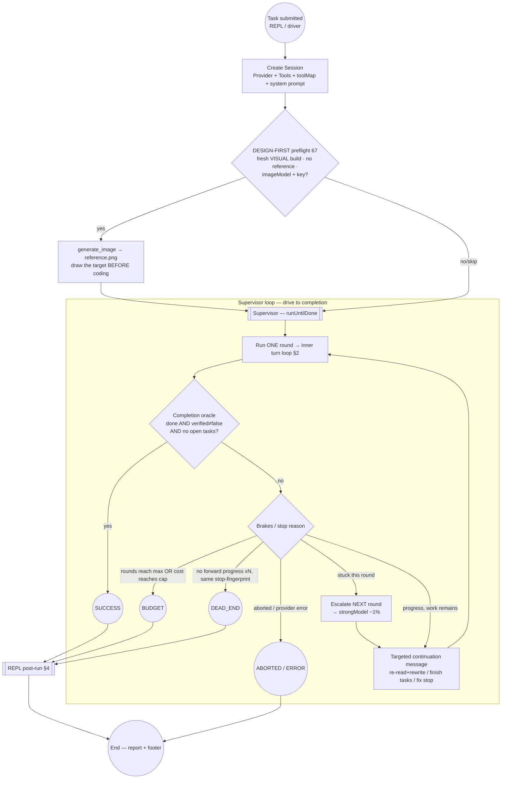
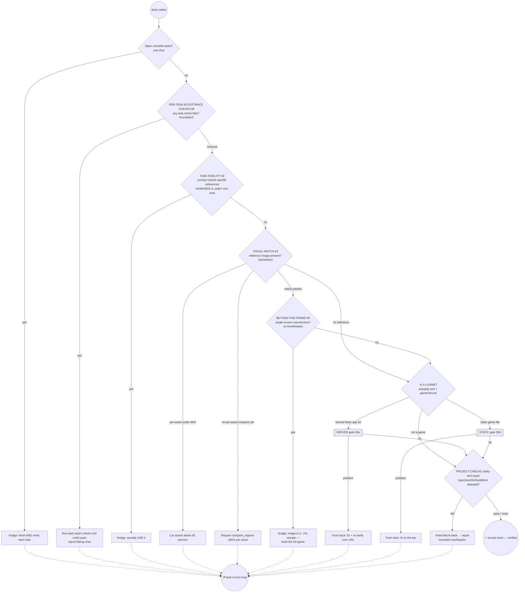
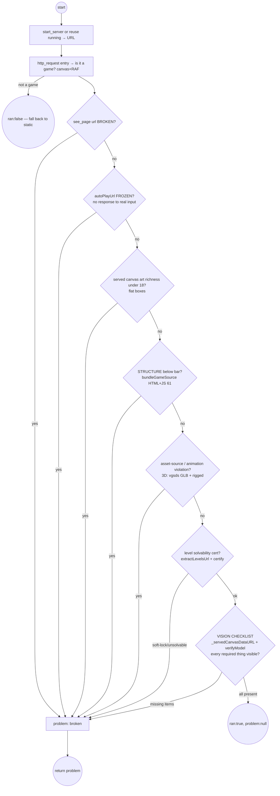
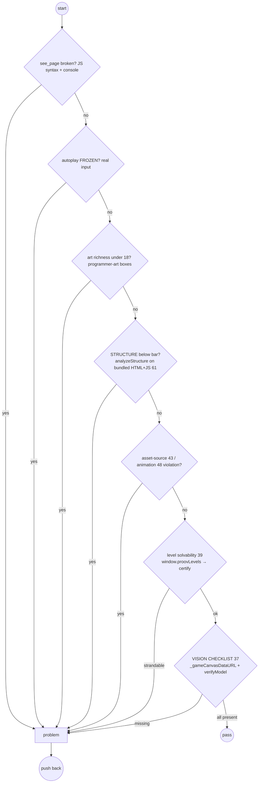
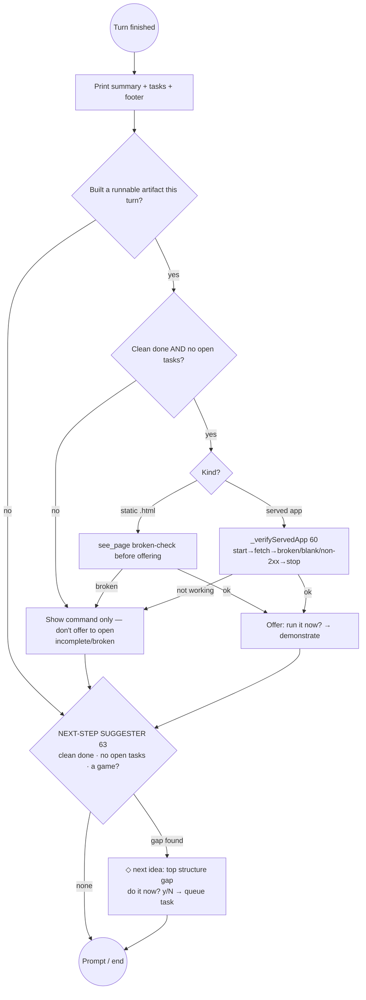
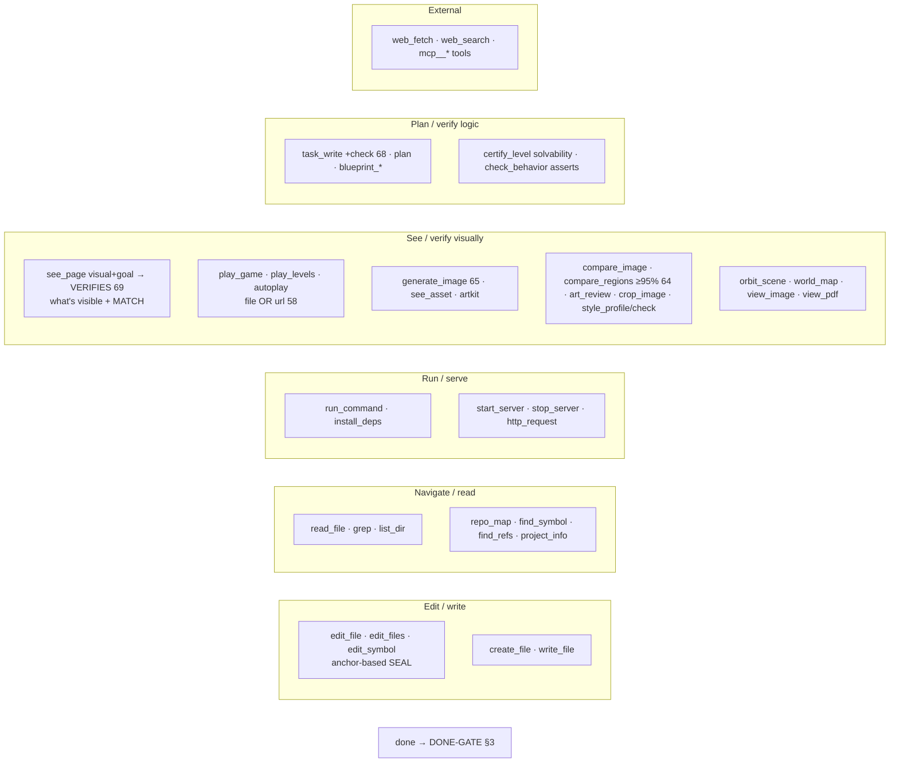

# Proov — Coding-Agent Workflow (detailed)

A deep map of how proov turns a task into a verified deliverable: every phase, action, gate, check and loop.
Rendered as BPMN-style **Mermaid** diagrams (events = circles, tasks = rectangles, gateways = diamonds).
A formal **BPMN 2.0** file (openable in [bpmn.io](https://bpmn.io)) is at [`proov-workflow.bpmn`](./proov-workflow.bpmn).

Legend: `(( ))` start/end event · `[ ]` task/action · `{ }` exclusive gateway (decision) · `[[ ]]` sub-process.

---

## 1. Top-level lifecycle (Session → Supervisor → REPL)



---

## 2. Inner turn loop (`runLoop` — one tool call per turn)

```mermaid
flowchart TD
  t0((Round start)) --> step{steps left AND not aborted?}
  step -- no --> ret((Return result<br/>done/stopped/aborted/error))
  step -- yes --> nudgeF[Final-step / replan / control nudges as needed]
  nudgeF --> call[provider.chat → assistant text]
  call -- provider error --> perr[Record PROVIDER_ERROR] --> ret
  call --> parse[extractJSON + normalizeCall<br/>coerce ANY tool-call shape → tool,args 57]
  parse --> valid{Valid tool call?}
  valid -- no --> bad[Nudge: 'one JSON tool call'<br/>noProgress++ → cap → stop] --> step
  valid -- yes --> isDone{tool == done?}

  isDone -- yes --> gate[[DONE-GATE battery §3]]
  gate -- any gate pushes back --> step
  gate -- all pass --> fin[done=true · verified · emit] --> ret

  isDone -- no --> appr[Approval / safety gate beforeTool<br/>destructive blocklist + approval mode]
  appr -- deny --> dn[Denial nudge · denial-storm → stop] --> step
  appr -- allow --> exec[Execute tool toolMap §5]
  exec --> rec[trace + onStep + bridge events]
  rec --> mm{Result has image/pdf?}
  mm -- yes --> push[Push multimodal blocks → model SEES bytes]
  mm -- no --> guards
  push --> guards[Post-tool guards]

  subgraph G[Per-turn guards]
    guards --> thrash{Screenshot-thrash 59<br/>≥4 visual checks, no task done?}
    thrash -- yes --> tnudge[Nudge: BUILD the next task first] --> step
    thrash -- no --> efail{edit failed AND plan exists?}
    efail -- yes --> rnudge[Replan nudge once/streak] --> step
    efail -- no --> spin{Repeated identical FAILING call?<br/>anti-stuck sentinel}
    spin -- yes --> shint[Recovery hint → failStop] --> ret
    spin -- no --> step
  end
```

---

## 3. The DONE-GATE battery (verification — runs when `done` is called)

Gates run **in order**; the first that finds a problem pushes a corrective message and the turn loop continues (the agent fixes and re-calls `done`). Bounded gates cap their push-backs so a weak model can't deadlock.



### 3a. SERVED-game gate (`_verifyServedGame`, judged over HTTP — Blocks 60/62)



### 3b. STATIC-game gate (file-based — Blocks 37–48, 61)



---

## 4. REPL post-run (interactive: verify → demonstrate → suggest next)



---

## 5. Tool catalog (the `toolMap` the agent acts through)



---

## 6. Every gate / check at a glance

| # | Gate / check | When | Mechanism | Block |
|---|---|---|---|---|
| — | Design-first preflight | turn-loop start (visual, no ref) | proov `generate_image` → `reference.png` | 67 |
| — | Approval / safety | before every mutating tool | destructive blocklist + approval mode (`auto` default) | — |
| — | Tool-call normalize | every turn | `normalizeCall` coerces any shape | 57 |
| — | Screenshot-thrash guard | post-tool | ≥4 visual checks, no task completed → nudge | 59 |
| — | Anti-stuck / spin | post-tool | repeated identical failing call → hint → stop | 25 |
| 1 | Open-tasks nudge | done | incomplete checklist → finish | — |
| 2 | Per-task acceptance checks | done | run each `task.check` (exit 0) | 68 |
| 3 | Task-fidelity | done | prompt-named lib/repo referenced nowhere | 58 |
| 4 | Visual-match (per-asset ≥95%) | done | `compare_regions` vs reference image | 64 |
| 5 | Beyond-the-frame | done (after match) | single-screen reproduction rejected | 66 |
| 6 | Served-game gate | done (start script) | broken/frozen/art/structure/asset/anim/level/**vision** over HTTP | 41/42/60/62 |
| 7 | Static-game gate | done (game file) | see_page/autoplay/art/structure/asset/anim/level/**vision** | 37/38/39/43/48/61 |
| 8 | Project-checks verify-repair | done | typecheck/lint/build/test, bounded repair | — |
| — | Served-app run gate | REPL offer | `_verifyServedApp` before "run it?" | 60 |
| — | Next-step suggester | REPL clean done | top structure gap → offer | 63 |
| — | Supervisor oracle / brakes | each round | done+verified+no-open / budget / dead-end / escalate | 46 |

Sources: `src/loop.mjs` (turn loop + done-gate), `src/supervisor.mjs` (rounds/oracle/brakes), `src/tools.mjs`
(tool implementations + served/visual/task-check helpers), `src/structure.mjs` (structure/beyond-frame/bundle),
`src/agent.mjs` (system prompt + toolMap), `src/repl.mjs` (post-run), `src/provider.mjs` (chat + image gen).
